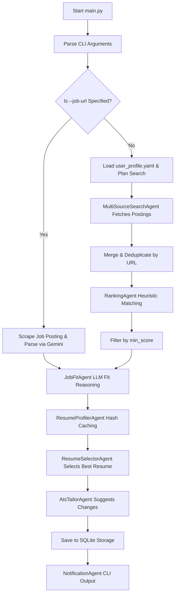

# 🤖 AI Job Assistant Agent

An autonomous, local multi-agent job search and candidate-matching assistant that automates target board planning, real-time scraping, match scoring, resume alignment analysis, and cover letter drafting.

---

## 📖 Problem Statement

For AI/ML practitioners and researchers, navigating today's job market is noisy and fragmented. Manually scanning multiple job boards, matching descriptions against strict personal criteria (such as PhD requirements, preferred frameworks, remote options, and legacy stack exclusions), and tracking application materials is a time-consuming process.

Existing alert services are simple keyword-based scrapers that fail to capture semantic alignment or calculate structured match-quality scores. The **AI Job Scout Agent** solves this by establishing an automated, multi-agent pipeline that plans searches, filters postings, evaluates candidate fit, and prepares personalized application materials.

---

## 🧠 What Makes This Agentic?

Unlike traditional linear scripts or basic API wrappers, this system relies on **autonomous multi-agent collaboration** and **reasoning-first architectures**:

1. **Collaborative Framework**: Built on **Google's Agent Development Kit (ADK)** protocols, separating tasks into specialized, modular agent modules that execute sequentially under a central root orchestrator.
2. **Autonomous Goal Planning**: Features a `PlanningAgent` that analyzes the user's profile and CLI overrides to construct a targeted search plan (defining target sources, search queries, and reasoning) *before* scraping begins.
3. **Structured Reflection**: Incorporates specialized reflection agents (`JobFitAgent`, `ResumeFitAgent`, and `ApplicationAgent`) to evaluate fit and generate context-aware application materials.
4. **Adaptive Flow**: Conditionally utilizes LLM reasoning or deterministic fallback heuristics based on environment configurations, maintaining operation even in offline settings.

---

## 👥 Agent Roles

The architecture divides responsibilities among the following specialized agents:

*   **`PlanningAgent`**: Analyzes user profile preferences (target roles, preferred locations, remote preferences) and CLI overrides to autonomously generate a structured `SearchPlan` consisting of the optimal sources, search queries, and planning reasoning.
*   **`MultiSourceSearchAgent`**: Orchestrates parallel queries across all planned job sources (local sample database, Arbeitnow API, Remotive API, URL), merging results, logging statistics, and deduplicating listings by normalized URLs.
*   **`RankingAgent` (JobMatcher)**: Computes candidate-to-job matches based on profile parameters (roles weighting 30%, required skills weighting 40%, and custom keywords weighting 30%), applying penalties for legacy technology stacks.
*   **`JobFitAgent`**: Performs semantic candidate fit evaluation to determine overall alignment, cataloging candidate strengths, identifying skill/experience gaps, and recommending whether to apply.
*   **`ResumeProfilerAgent`**: Extracted structured profile records (skills, education, summary) from raw resumes and caches them in the SQLite DB based on SHA-256 content hashes to avoid redundant LLM queries.
*   **`ResumeSelectorAgent`**: Automatically scans the resumes folder (supporting `.txt`, `.md`, `.json`, `.pdf`, `.docx`) and selects the single most relevant resume matching the job post requirements.
*   **`AtsTailorAgent`**: Evaluates the selected resume against the job description and suggests tailored ATS optimizations (summaries, keywords, and rephrased bullets) without fabricating any facts or experience.
*   **`NotificationAgent` (JobNotifier)**: Formats final outputs, printing execution pipelines, match metrics, fit analyses, chosen resumes, and detailed ATS suggestions to the console.

---

## 🔄 Current Pipeline




---

## 📂 Project Structure

```
ai-job-scout-agent/
├── config/                 # User configurations
│   └── user_profile.yaml   # Target roles, skills, and match thresholds
├── data/                   # Data directories
│   ├── sample_jobs.json    # Local mock postings database
│   └── job_scout.db        # SQLite persistence database (created automatically)
├── docs/                   # Documentation
│   ├── architecture.md     # Architectural designs
│   ├── architecture_diagram.md # Diagram and data flow explanations
│   └── demo_script.md      # Video demo walkthrough script
├── src/                    # Python package source code
│   ├── adk/                # Root agent ADK orchestration layer
│   ├── agent/              # Main scout run-loop pipeline
│   ├── agents/             # Modular agent implementations
│   ├── config/             # User profile and settings configurations
│   ├── llm/                # Safe Gemini client wrapper
│   ├── notifications/      # Notification formatter outputs
│   ├── ranking/            # Match scoring heuristics
│   ├── sources/            # Scrapers and API source connectors
│   └── storage/            # SQLite database adapters
├── tests/                  # Pytest verification suites (59 test cases)
├── pyproject.toml          # Package metadata and requirements definitions
├── requirements.txt        # Virtual environment dependencies
└── main.py                 # CLI application entry point
```

---

## 🛠️ Setup & Installation

### Prerequisites
*   Python `3.10` or higher
*   Git

### 1. Clone the Repository
```bash
git clone https://github.com/amfooladgar/ai-job-scout-agent.git
cd ai-job-scout-agent
```

### 2. Create and Activate a Virtual Environment
```bash
# Create environment
python3 -m venv .venv

# Activate (macOS/Linux)
source .venv/bin/activate

# Activate (Windows Command Prompt)
.venv\Scripts\activate.bat
# Or in Windows PowerShell:
.\.venv\Scripts\Activate.ps1
```

### 3. Install Dependencies
```bash
pip install -r requirements.txt
# Or install as an editable package
pip install -e .
```

### 4. Configure Environment variables
Copy the template variables file:
```bash
cp .env.example .env
```

---

## 🏃 Running Demo Commands

The agent operates as a flexible CLI tool. Run the following demo workflows to test various settings:

### 1. Offline Mode (Default Sample Source)
Run the pipeline fully offline using the local mock job database:
```bash
python3 main.py --source sample
```

### 2. Multi-Source Search with Custom Matching Score
Search all active job boards (Sample + Arbeitnow + Remotive), deduplicate listings, and override the minimum match score to a lower threshold (e.g., `0.5`):
```bash
python3 main.py --source all --min-score 0.5
```

### 3. LLM Reasoning Mode
Enable optional Gemini-powered reasoning to perform deep job fit analysis, resume selection, and custom cover letter drafting (requires configuring `GEMINI_API_KEY` in your environment):
```bash
python3 main.py --source sample --enable-llm-reasoning
```

### 4. Direct Job URL Ingestion & Resume Optimization
Instruct the agent to scrape a job post from a specific URL, load resumes from your `data/resumes/` folder (supporting `.txt`, `.md`, `.json`, `.pdf`, `.docx`), select the best-matching resume, and generate tailing ATS recommendations:
```bash
python3 main.py --job-url "https://www.arbeitnow.com/jobs/sample-job-url" --enable-llm-reasoning
```

---

## 🔒 Safety and Cost Controls

This application is designed to be production-safe, private, and cost-controlled:

*   **Resume Profile Caching**: A SHA-256 content hash is computed for each resume file in `data/resumes/`. The parsed profile details are persisted in the local SQLite database. The agent only re-analyzes a resume file when it is newly added or modified, saving Gemini API calls.
*   **Local-First Design**: The agent executes fully locally on your machine by default. High-cost API operations are completely avoided unless explicitly requested.
*   **Gemini Disabled by Default**: LLM reasoning features are optional. If the `--enable-llm-reasoning` flag is absent, the agent uses fast, free deterministic fallback logic.
*   **No Cloud Deployments**: Runs as a standard CLI script. There is no requirement for paid cloud servers, VM setups, or third-party database subscriptions.
*   **Secure API Keys**: If using Gemini, the API key is read solely from local environment variables or a git-ignored `.env` file, preventing accidental exposure of credentials.

---

## ⚠️ Current Limitations

*   **Public Feeds Only**: Connects to public, unauthenticated feed endpoints which do not require key authorization.
*   **Local Substring Matching**: By default, deterministic matching matches exact substring queries, which does not capture deep semantic relations without enabling LLM mode.

---

## 🗺️ Future Work

*   **Email & Slack Notifications**: Real-time push alert integrations utilizing Slack webhooks and SMTP mail dispatches.
*   **Scheduling & Monitoring**: Integrated cron task scheduling and heartbeat health check monitoring services.
*   **More Job Boards**: Authenticated scrapers and API adapters for additional job boards (e.g., LinkedIn, Greenhouse, Lever).
*   **UI Dashboard**: A local visual web application (e.g., Streamlit or React) to explore, filter, and track applications.

